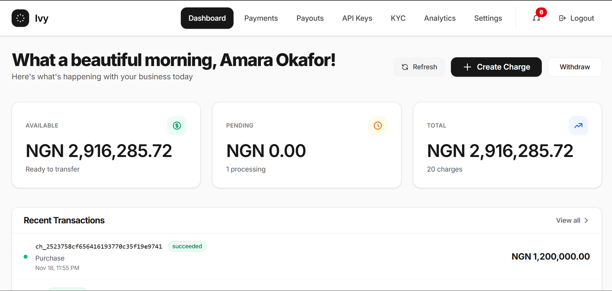
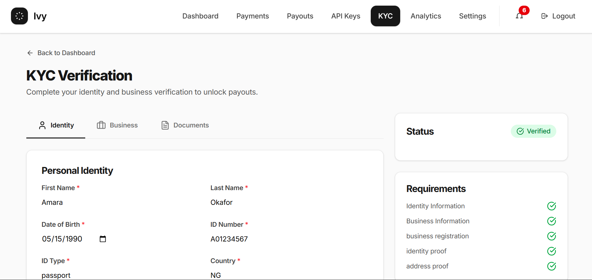
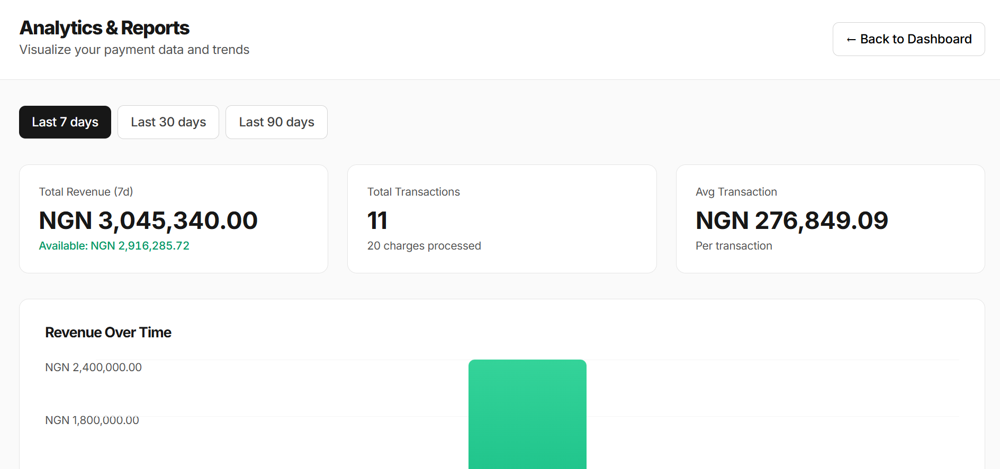

<div align="center">

# Ivy

[](https://python.org)
[](https://fastapi.tiangolo.com)
[](https://postgresql.org)
[](https://redis.io)
[](LICENSE)
[](docker-compose.yml)

**Payment infrastructure for B2B platforms.**

Accept payments • Automate settlements • Manage merchants

[Getting Started](#quickstart) · [Documentation](#api-overview) · [Features](#features)

</div>

---

Ivy is a payment gateway designed for B2B platforms. It handles the complexity of payment processing double-entry accounting, settlement cycles, merchant onboarding, KYC verification so you probably don't have to build it yourself. The system implements an event-driven architecture. It utilizes a high-performance asynchronous API for request handling, while offloading resource intensive operations (such as the ledger updates, settlements, and webhook delivery) to specialized worker queues.

---

---


### Built with
- **FastAPI** — async API with auto-generated docs
- **PostgreSQL** — ACID transactions, double-entry ledger
- **Celery + Redis** — background processing, scheduled settlements
- **React** — merchant dashboard

## Features

| Feature | Description |
|---------|-------------|
| **Double-Entry Ledger** | Every transaction balanced. Zero-sum accounting. |
| **Async Processing** | Charges processed in background, webhooks delivered with retries. |
| **Auto Settlements** | Nightly cron moves funds from pending → available. |
| **2FA & Rate Limiting** | TOTP authentication, brute-force protection. |
| **Webhooks** | HMAC-signed payloads, exponential backoff retries. |
|  **API Keys** | Secret keys hashed at rest, publishable keys for frontend. |
| **KYC Flow** | Identity verification, document uploads, business validation. |

---

## Quickstart

### Docker (Highly recommended)

```bash
# Clone
git clone https://github.com/astrovine/ivy-payment-gateway.git
cd ivy-payment-gateway

# Configure
cp .env.example .env

# Run
docker-compose up --build

# Migrate
docker-compose exec web alembic upgrade head
```

| Service | URL |
|---------|-----|
| API Docs | http://localhost:8000/docs |
| Frontend | http://localhost:5173 |

### Local Development

```bash
# Backend
python -m venv venv && source venv/bin/activate
pip install -r app/requirements.txt
uvicorn app.main:app --reload

# Worker (use like a separate terminal)
celery -A app.celery_worker.celery_app worker -l info

# Frontend
cd client && npm install && npm run dev
```

---

## API Overview

```bash
# Create a charge
curl -X POST http://localhost:8000/api/v1/charges \
  -H "Authorization: Bearer <token>" \
  -H "Content-Type: application/json" \
  -d '{"amount": 10000, "currency": "NGN", "description": "Bought frank oceon blonde"}'
```

| Endpoint | Method | Description |
|----------|--------|-------------|
| `/auth/register` | POST | Create merchant account |
| `/auth/login` | POST | Get access token |
| `/charges` | POST | Create payment |
| `/merchant/balance` | GET | View pending/available funds |
| `/webhooks` | POST | Register webhook endpoint |
| `/payouts` | POST | Initiate withdrawal |
| `/2fa/enable` | POST | Setup two-factor auth |

Full API docs at [`/docs`](http://localhost:8000/docs) when running.

## Screenshots

<details>
<summary>Dashboard</summary>



</details>

<details>
<summary>KYC</summary>



</details>

<details>
<summary>Analytics</summary>



</details>

---

## Configuration

Create a `.env` file:

```env
# Database
DATABASE_NAME=ivy
DATABASE_USER=postgres
DATABASE_PASSWORD=postgres
DATABASE_HOST=localhost
DATABASE_PORT=5432

# Auth (please generate with: openssl rand -hex 32)
SECRET_KEY=your_secret_key
ALGORITHM=HS256
ACCESS_TOKEN_EXPIRE_MINUTES=1440

# Redis
REDIS_URL=redis://localhost:6379/0

# Optional: OAuth
GOOGLE_CLIENT_ID=...
GITHUB_CLIENT_ID=...
```

---

## Testing

```bash
pytest                      # Run all tests
pytest --cov=app tests/     # With coverage
pytest tests/test_tasks.py  # Specific file
```

---

# Disclaimer

Please do not attempt to use this for real transaction it isn't integrated into any real payment system or banking system. While the core logic/engine works, it will not be capable of processing naira(or any real currency flow). Feel free to build upon the logic and infrastructure for whatever use case you might have.

