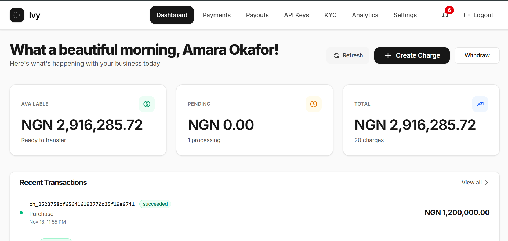
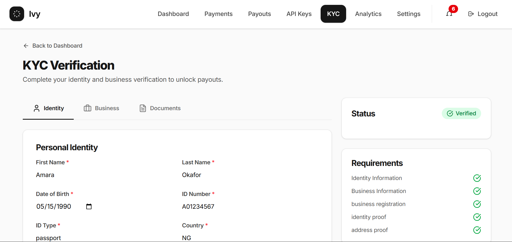
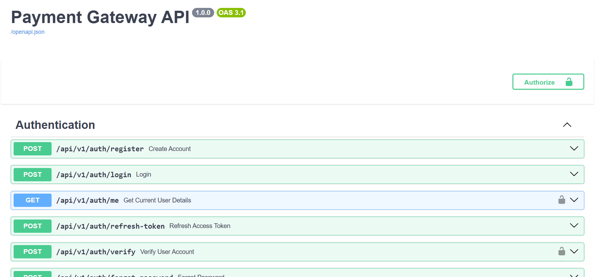

# Payment Gateway for B2B

A production-ready payment gateway for B2B transactions. Ivy provides the financial infrastructure to accept payments, automate settlements, and manage merchant operations with enterprise-grade reliability and security.
Built with a double-entry ledger system, ACID-compliant transactions, and event-driven architecture — everything you need to power payments at scale.
**Core Technologies:** FastAPI, Celery, PostgreSQL, Redis, Docker, and React.

## Table of Contents

- [System Architecture](#system-architecture)
- [Interface and Demos](#interface-and-demos)
- [Key Features](#key-features)
- [Technology Stack](#technology-stack)
- [Repository Structure](#repository-structure)
- [Quickstart (Docker)](#quickstart-docker)
- [Local Development (Manual)](#local-development-manual)
- [Testing](#testing)
- [API Overview](#api-overview)
- [License](#license)

---

## System Architecture
The system implements an event-driven microservices architecture. It utilizes a high-performance asynchronous API for request handling, while offloading resource-intensive operations (ledger updates, settlements, and webhook delivery) to specialized worker queues.

---


---

## Key Features

### Core Payments
* **Double-Entry Ledger:** Implements a rigid accounting system where every transaction is recorded as a credit and debit, ensuring ACID compliance and zero-sum validity.
* **Idempotency:** Prevents duplicate charges using cache-based idempotency keys, allowing clients to safely retry network requests without creating double-spending issues.
* **Charge Lifecycle:** Manages complex transaction states (e.g., `pending`, `succeeded`, `failed`) using asynchronous processing.

### Merchant Operations
* **Automated Settlements:** Nightly cron jobs (via Celery Beat) automatically move funds from a "pending" state to an "available" balance based on defined settlement schedules (e.g., T+2).
* **Payouts:** Merchants can initiate withdrawals to linked external bank accounts.
* **KYC Verification:** A multi-step flow for identity and business verification, including document uploads and validation.

### Developer Experience
* **Webhooks:** Event-driven architecture that delivers signed payloads (HMAC-SHA256) to merchant endpoints with exponential backoff retries for failed deliveries.
* **API Keys:** Secure authentication system using hashed secret keys and public publishable keys.

---

## Technology Stack

| Component | Technology | Purpose |
| :--- | :--- | :--- |
| **Backend** | Python, FastAPI | High-performance asynchronous API with Pydantic data validation. |
| **Database** | PostgreSQL, SQLAlchemy | Relational data storage ensuring ACID transaction compliance. |
| **Migrations** | Alembic | Version control for database schemas. |
| **Async Tasks** | Celery | Background processing for payments, emails, and settlements. |
| **Broker/Cache** | Redis | Message broker for Celery queues and caching for idempotency keys. |
| **Frontend** | React, Vite, Tailwind | Responsive and modern merchant dashboard. |
| **Deployment** | Docker Compose | Container orchestration for consistent local development environments. |

---

## Interface and Demos

### 1. Merchant Dashboard
Provides a real-time overview of pending versus available balances, recent transactions, and daily payment volume.


### 2. API Key Management
Allows merchants to securely generate, view, and revoke API keys for both Test and Live environments.


### 3. Developer Documentation
Interactive API documentation generated automatically by Swagger UI, allowing for easy testing and integration.


## 4. Analytics & Reports
A comprehensive page for visualizing transaction data and past trends


## Repository Structure

```bash
├── app/                    # Backend Application
│   ├── main.py             # Application entry point
│   ├── routers/            # API Endpoints (Auth, Charges, Webhooks)
│   ├── services/           # Business Logic (Ledger, Settlements)
│   ├── models/             # SQLAlchemy Database Models
│   ├── schemas/            # Pydantic Data Transfer Objects
│   ├── tasks.py            # Celery Task Definitions
│   └── utilities/          # Configuration, Logging, Security Helpers
├── client/                 # Frontend Application (React + Vite)
├── alembic/                # Database Migration Scripts
├── tests/                  # Pytest Unit and Integration Tests
└── docker-compose.yml      # Container Orchestration Configuration
```

---

## Quickstart (Docker)

The recommended method for running the project locally is via Docker Compose.

1.  **Clone the repository:**
    ```bash
    git clone https://github.com/astrovine/payment-gateway.git
    cd payment-gateway
    ```

2.  **Configure Environment Variables:**
    Create a `.env` file in the root directory (or copy from `.env.example').
    ```properties
    DATABASE_NAME=payments
    DATABASE_USER=postgres
    DATABASE_PASSWORD=postgres
    DATABASE_HOST=localhost
    DATABASE_PORT=5433
    # Run: openssl rand -hex 32
    SECRET_KEY=your_generated_secret_key_here
    ALGORITHM=HS256
    ACCESS_TOKEN_EXPIRE_MINUTES=1440
    REFRESH_TOKEN_EXPIRE_DAYS=30
    
    REDIS_URL=redis://redis:6379/0
    
    # Third Party Services
    CLOUDINARY_CLOUD_NAME=your_cloud_name
    CLOUDINARY_API_KEY=your_api_key
    CLOUDINARY_API_SECRET=your_api_secret
    
    GOOGLE_CLIENT_ID=your_google_client_id
    GOOGLE_CLIENT_SECRET=your_google_client_secret
    GOOGLE_REDIRECT_URI=http://localhost:8000/api/v1/auth/google/callback
    
    SESSION_SECRET_KEY=your_session_secret_key
    GITHUB_CLIENT_ID=your_github_client_id
    GITHUB_CLIENT_SECRET=your_github_client_secret
    ```

3.  **Build and Start Services:**
    ```bash[Show Image.url](../../../../../../Users/USER/AppData/Local/Temp/Show%20Image.url)
    docker-compose up --build
    ```

4.  **Run Database Migrations:**
    ```bash
    docker compose exec web alembic upgrade head
    ```

5.  **Access the Application:**
    * **Frontend:** `http://localhost:5173`
    * **API Documentation:** `http://localhost:8000/docs`

---

## Local Development (Manual)

If you prefer to run the application without Docker, follow these steps.

### Backend Setup

1.  **Initialize Virtual Environment:**
    ```bash
    python -m venv .venv
    source .venv/bin/activate  # Windows: .venv\Scripts\activate
    ```

2.  **Install Dependencies:**
    ```bash
    pip install -r app/requirements.txt
    ```

3.  **Run Migrations:**
    Ensure Redis and PostgreSQL are running locally before executing:
    ```bash
    alembic upgrade head
    ```

4.  **Start the API Server:**
    ```bash
    uvicorn app.main:app --reload
    ```

5.  **Start Celery Worker:**
    Open a new terminal window and run:
    ```bash
    celery -A app.celery_worker.celery_app worker --loglevel=info
    ```

### Frontend Setup

1.  **Install Node Dependencies:**
    ```bash
    cd client
    npm install
    ```

2.  **Start Development Server:**
    ```bash
    npm run dev
    ```

---

## Testing

This project uses `pytest` for comprehensive unit and integration testing.

```bash
# Run all tests
pytest

# Run tests with coverage report
pytest --cov=app tests/
```

---

## API Overview

| Method | Endpoint | Description |
| :--- | :--- | :--- |
| `POST` | `/api/v1/auth/register` | Register a new merchant user account. |
| `POST` | `/api/v1/charges` | Create a new charge (Idempotent). |
| `GET` | `/api/v1/merchant/balance` | View available and pending balance for the authenticated merchant. |
| `POST` | `/api/v1/webhooks` | Register a URL to receive event notifications. |
| `POST` | `/api/v1/payouts` | Initiate a withdrawal of funds to a connected bank account. |

---

## License

This project is licensed under the MIT License.